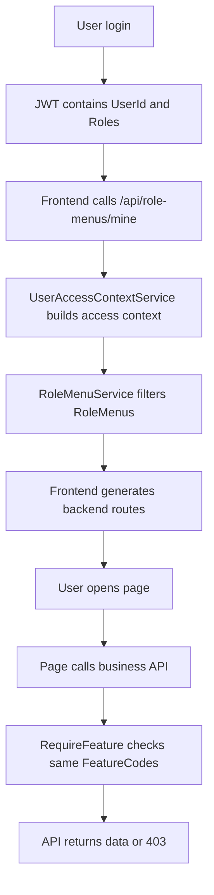

# 统一权限 / 菜单 / API 设计文档

> 目标：让前端菜单可见性、后端 API 可访问性、订阅功能、职业身份 Persona 使用同一套权限语义，避免“菜单能看到但接口不能用”或“接口能访问但菜单不可见”的割裂。

## 1. 当前项目结论

本项目是一个个人成长 + 工作管理 + 多职业平台。当前运行时主链路已经接近目标形态：

- 前端 `vue-vben-admin/apps/web-antd/src/preferences.ts` 使用 `accessMode: 'backend'`。
- 前端路由由 `/api/system/role-menus/mine` 动态返回，`router/access.ts` 将后端菜单转换为 Vue Router records。
- 后端运行时菜单主表是 `RoleMenus`，核心字段包括 `MinRoleLevel`、`PersonaTag`、`FeatureCode`、`Component`、`Path`。
- 后端功能点主表是 `Features`，订阅映射是 `PlanFeatures`，Persona 功能映射是 `PersonaFeatures`。
- 用户实际功能集已经统一由 `UserAccessContextService` 计算：普通功能来自有效套餐；`Category = Persona` 的功能必须同时满足“套餐包含该功能”和“用户拥有对应 Persona”。Owner 拥有全部启用功能。
- 菜单过滤已经校验当前节点及所有父级链：角色等级、Persona、FeatureCode、启用/可见状态都必须通过。
- 前端动态路由生成前会重置旧动态路由，避免切换账号后保留上一个用户的 Pro 路由。

当前需要继续遵守的实现约束：

- 页面可进入不代表页面内部所有接口都可调用。页面内部的统计卡、下拉数据、快捷入口、操作按钮必须按 `accessCodes` 做功能码降级。
- 基础页不能无条件请求 Pro 接口。例如 `/work/dashboard` 不能让 Member 请求 `/api/work/statistics/overview`，`/work/tasks` 不能让没有 `WORK_PROJECT` 的用户请求 `/api/work/projects`。
- 学生页同理。例如 `/student/records` 不能让没有 `STUDENT_SUBJECTS` 的用户请求 `/api/student/subjects`。
- Seeder 面向 MySQL Provider 时，避免在 EF 查询里使用动态集合 `Contains` 或动态参数 `StartsWith`，这类匹配应先取小集合再在内存中过滤。

## 2. 统一权限模型

### 2.1 三层权限

系统权限分三层，按用途区分，不混用：

| 层级 | 作用 | 表/字段 | 用途 |
|---|---|---|---|
| Role | 身份等级 | `Users.Roles`, `RoleMenus.MinRoleLevel` | Member / Pro / Owner 的基础门槛 |
| Feature | 功能授权 | `Features`, `PlanFeatures`, `PersonaFeatures` | 是否拥有某个功能点 |
| Persona | 职业身份 | `UserPersonas`, `RoleMenus.PersonaTag` | 是否显示职业专属模块 |

推荐语义：

- `Role` 决定管理能力和等级门槛。
- `Feature` 决定功能是否可用，是菜单和 API 的共同授权单位。
- `Persona` 决定职业场景和职业扩展能力。

### 2.2 统一公式

用户上下文：

```text
UserContext =
  UserId
  HighestRoleCode
  RoleLevel
  PersonaCodes
  PlanCode
  FeatureCodes =
    NonPersonaPlanFeatures
    ∪ (PersonaPlanFeatures ∩ ActiveUserPersonaFeatures)
    ∪ AllEnabledFeatures when RoleLevel >= Owner
```

菜单可见：

```text
CanViewMenu(menu, user) =
  menu.IsEnabled
  && menu.IsVisible
  && user.RoleLevel >= menu.MinRoleLevel
  && (menu.PersonaTag is null || user.PersonaCodes contains menu.PersonaTag)
  && (menu.FeatureCode is null || user.FeatureCodes contains menu.FeatureCode)
```

API 可访问：

```text
CanAccessApi(endpoint, user) =
  IsAuthenticated
  && RoleRequirementPass
  && (RequiredFeature is null || user.FeatureCodes contains RequiredFeature)
```

按钮可用：

```text
CanUseAction(action, user) =
  CanViewMenu(action.Menu, user)
  && user.RolePermissions allows action.ActionCode
```

## 3. 数据模型建议

### 3.1 保留为运行时主模型

#### `RoleMenus`

作为唯一运行时菜单表。

| 字段 | 说明 |
|---|---|
| `ParentId` | 菜单树父级 |
| `Name` | 菜单标题 |
| `Path` | 前端路由路径，必须唯一 |
| `Component` | 前端组件路径，如 `/views/work/log/index.vue` |
| `Icon` | 图标 |
| `Sort` | 同级排序 |
| `MinRoleLevel` | 1 Member, 2 Pro, 3 Owner |
| `PersonaTag` | 可选，职业专属菜单 |
| `FeatureCode` | 可选，绑定功能点 |
| `MenuCategory` | Dashboard/Growth/Work/AI 等 |
| `IsVisible` | 是否展示 |
| `IsEnabled` | 是否启用 |

建议补约束：

- `Path` 唯一索引。
- `FeatureCode` 外键或至少后台校验存在于 `Features.Code`。
- `PersonaTag` 后台校验存在于 `PersonaTypes.Code`。
- `Component` 后台校验非空叶子菜单必须填写。

#### `Features`

作为功能授权原子。

命名建议：

```text
模块_资源_动作
WORK_LOG_VIEW
WORK_LOG_CREATE
WORK_PROJECT_VIEW
GROWTH_HABIT_VIEW
AI_ASSISTANT_USE
SYSTEM_USER_MANAGE
```

当前项目已有 `WORK_LOG`、`GROWTH_HABIT` 这种粗粒度 Code，可以先保留；后续按钮级权限需要再细分。

### 3.2 逐步废弃或迁移

以下模型建议不再参与运行时权限判断：

- `MenuItems`
- `MenuTags`
- `UserTags`
- `PersonaMenuItems`
- `UserPersonaRecords` 仅作为切换历史保留，不参与菜单计算

处理方式：

1. 短期：保留表和页面，但标注为 Legacy。
2. 中期：把“菜单标签”页面并入 `RoleMenus` 管理页。
3. 长期：如果不再需要标签菜单，删除旧控制器和前端页面。

## 4. 后端服务设计

### 4.1 新增统一用户权限上下文服务

建议新增：

```csharp
public interface IUserAccessContextService
{
    Task<UserAccessContext?> GetAsync(Guid userId, CancellationToken ct = default);
}

public sealed record UserAccessContext(
    Guid UserId,
    string RoleCode,
    int RoleLevel,
    IReadOnlySet<string> PersonaCodes,
    string PlanCode,
    IReadOnlySet<string> FeatureCodes
);
```

职责：

- 获取用户最高 Role。
- 获取用户 PersonaCodes。
- 获取有效订阅 PlanCode，默认 Free。
- 计算 `FeatureCodes = PlanFeatures ∪ PersonaFeatures`。
- 可加入短缓存，例如 1-5 分钟，用户订阅、Persona、Feature 管理变更时清理。

替换范围：

- `RoleMenuController.GetUserAvailableFeaturesAsync`
- `SubscriptionController.GetUserFeatureCodesAsync`
- `FeatureService.GetUserFeaturesAsync`
- `RequireFeatureAttribute.OnAuthorizationAsync`

### 4.2 RoleMenuService 只负责菜单

`RoleMenuService` 不应自己拼用户上下文，只接收 `UserAccessContext`：

```csharp
Task<List<RoleMenuDto>> GetMenusForUserAsync(UserAccessContext access, CancellationToken ct);
```

职责：

- 查询启用菜单。
- 按统一公式过滤。
- 自动补父节点。
- 构建树。
- 输出 DTO，避免直接返回 EF 实体。

### 4.3 Feature 权限统一走 Policy

当前 `RequireFeatureAttribute` 直接查 Db，建议改为基于服务：

```csharp
[RequireFeature("WORK_LOG")]
```

内部使用 `IUserAccessContextService` 或 `IFeatureService`，不要重复 SQL。

更理想的 ASP.NET Core 方式：

```csharp
[Authorize(Policy = "Feature:WORK_LOG")]
```

短期可以保留 Attribute，先把重复逻辑抽出来。

## 5. API 权限设计

### 5.1 API 与菜单的绑定规则

每个需要授权的业务 API 必须绑定一个 FeatureCode。

| 菜单 | 菜单 FeatureCode | API | API RequiredFeature |
|---|---|---|---|
| 工作日志 | `WORK_LOG` | `/api/work/logs/*` | `WORK_LOG` |
| 工作项目 | `WORK_PROJECT` | `/api/work/projects/*` | `WORK_PROJECT` |
| 设备管理 | `WORK_DEVICE` | `/api/work/devices/*` | `WORK_DEVICE` |
| 数据导入 | `WORK_IMPORT` | `/api/work/import/*` | `WORK_IMPORT` |
| 知识库 | `GROWTH_KNOWLEDGE` | `/api/growth/knowledge-base/*` | `GROWTH_KNOWLEDGE` |
| AI 助手 | `AI_ASSISTANT` | `/api/ai/chat` | `AI_ASSISTANT` |

规则：

- 有菜单的页面，其页面主 API 必须有同名或同组 Feature。
- 无菜单但需要保护的 API，也必须定义 Feature。
- Owner 管理 API 用 Role 限制即可，也可增加 Feature：`SYSTEM_ADMIN`、`SYSTEM_USER_MANAGE`。

### 5.2 推荐响应语义

| 场景 | HTTP | ApiResult.Code | 说明 |
|---|---:|---:|---|
| 未登录 | 401 | 401 | 缺 Token 或 Token 无效 |
| 已登录但无角色权限 | 403 | 403 | Role 不满足 |
| 已登录但无 Feature | 403 | 403 | Feature 不满足 |
| 资源不存在 | 404 | 404 | 不暴露他人资源时也可返回 404 |
| 参数错误 | 400 | 400 | 模型校验失败 |
| 成功 | 200/201 | 0 | `data` 为业务数据 |

当前 `ApiResult.Fail` 默认 code 为 1，可以逐步把 401/403/404 具体化。

## 6. 前端契约设计

### 6.1 后端菜单 DTO

前端应统一到后端真实模型：

```ts
export interface RoleMenuItem {
  id: string;
  parentId?: string;
  name: string;
  path: string;
  icon?: string;
  component?: string;
  sort: number;
  isVisible: boolean;
  isEnabled: boolean;
  permission?: string;
  redirect?: string;
  isExternal: boolean;
  badge?: string;
  tag?: string;
  minRoleLevel: number;
  personaTag?: string;
  menuCategory: string;
  featureCode?: string;
  children?: RoleMenuItem[];
}
```

应移除旧字段：

```ts
bindingType
bindingValue
```

### 6.2 路由转换规则

后端 `component` 推荐存储：

```text
/views/work/log/index.vue
```

前端转换为 Vben 可识别组件：

```text
../views/work/log/index.vue
```

当前 `router/access.ts` 直接把 `menu.component` 放进 route record。建议确认 Vben `generateAccessible` 是否能解析 `/views/...`。如果不能，转换时统一去掉开头 `/views/` 并映射到 `pageMap`。

### 6.3 前端按钮权限

页面内部权限规则：

- 菜单控制“页面能不能进入”。
- `accessCodes` 控制“页面内部哪些接口、区块、下拉、按钮能不能出现”。
- 页面加载时禁止无条件请求当前用户没有 FeatureCode 的接口。
- 用户没有权限的辅助数据应降级为隐藏、普通输入或空状态，而不是弹 403。

已落地示例：

- `/work/dashboard`：Member 不请求 `WORK_STATISTICS`，不显示项目、设备、导入等 Pro 快捷入口。
- `/work/tasks`：没有 `WORK_PROJECT` 时不请求项目列表，不显示项目列和所属项目字段。
- `/student/records`：没有 `STUDENT_SUBJECTS` 时不请求科目列表，科目字段降级为文本输入。
- `/student/dashboard`：按 `STUDENT_LEARNING`、`STUDENT_RECORDS`、`STUDENT_SUBJECTS` 控制操作列、最近记录和科目进度区。

后续按钮级权限：

- `/api/auth/codes` 返回按钮权限码。
- 按钮用 `v-access` 或 store 判断。

- `MenuActions + RolePermissions + FeatureCode` 合并生成 `accessCodes`。

## 7. 推荐端到端流程



## 8. 当前问题清单

### P0：权限计算重复

状态：已收敛到 `UserAccessContextService`，`FeatureService` 与 `RequireFeatureAttribute` 复用统一上下文。

后续注意：新增 Feature、Plan、Persona 规则必须先改上下文服务和测试，不要在 Controller 里重复拼 SQL。

### P0：菜单表分叉

运行时使用 `RoleMenus`，但系统里仍有 `MenuItems/MenuTags/PersonaMenuItems`。

影响：管理后台可能维护了一套不会影响运行时菜单的数据。

处理：明确 `RoleMenus` 为主表；旧菜单页面迁移或下线。

### P1：API Feature 覆盖不足

大量业务 Controller 只有 `[Authorize]`，没有 `[RequireFeature]`。

影响：用户可能绕过菜单直接访问 API。

处理：按模块补 RequiredFeature。

### P1：页面内部 Feature 降级需要持续补齐

现象：用户能进入基础页，但页面内部请求了高级功能接口，导致 403 红色提示。

处理原则：

1. 页面加载前读取 `useAccessStore().accessCodes`。
2. 没有对应 FeatureCode 时不要请求接口。
3. 隐藏关联列、统计卡、快捷入口和操作按钮。
4. 表单依赖高级字典时降级为普通输入或隐藏字段。

### P1：前端菜单类型落后

`RoleMenuItem` 仍有 `bindingType/bindingValue`。

影响：系统管理页和后端模型不一致。

处理：更新类型和角色菜单页面表单。

### P1：RoleMenus 管理接口权限过宽

`/api/role-menus` 当前只要求 `[Authorize]`。

影响：普通登录用户可能访问菜单管理 API。

处理：管理接口加 `[Authorize(Roles = "owner")]`，`/mine` 保持登录可用。

## 9. 落地顺序

### 阶段 1：统一运行时权限核心

1. 新增 `UserAccessContext` 和 `IUserAccessContextService`。
2. 替换 `FeatureService`、`RequireFeatureAttribute`、`RoleMenuController`、`SubscriptionController` 的重复逻辑。
3. `RoleMenuService` 改为接收上下文。
4. 给 `/api/role-menus` 管理接口加 Owner 权限，保留 `/mine` 只需登录。

### 阶段 2：菜单模型收敛

1. 更新前端 `RoleMenuItem` 类型。
2. 更新 `system/role-menu` 页面字段：`minRoleLevel/personaTag/featureCode/menuCategory/component`。
3. 标记 `system/menu-tag` 为 Legacy 或迁移到 RoleMenus 管理。
4. 给 `RoleMenus.Path` 加唯一约束。

### 阶段 3：API Feature 覆盖

1. 给 Work/Growth/AI/Assets/Analytics 主要 Controller 补 `[RequireFeature]`。
2. 建立菜单 FeatureCode 与 Controller FeatureCode 映射表。
3. 为无菜单但敏感的 API 增加独立 Feature。

### 阶段 4：按钮级权限

1. 完善 `MenuActions`。
2. 完善 `RolePermissions`。
3. `/api/auth/codes` 返回按钮权限码。
4. 前端按钮统一使用 access directive。

## 10. 建议最终目录文档关系

- `PROJECT_DOCUMENTATION.md`：项目总览、模块、账号、启动方式。
- `PROJECT_ACCESS_MENU_API_DESIGN.md`：权限、菜单、API 统一设计。
- 后续可新增 `PROJECT_API_FEATURE_MATRIX.md`：每个菜单、页面、API、FeatureCode 的矩阵表。
